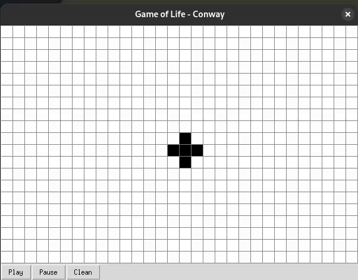

# Conway's Game of Life - Python + Tkinter

This is a simple implementation of **Conway's Game of Life**, developed in Python with a graphical interface using **Tkinter**.  
The project is split into two components:  
- A core logic engine that simulates the game.  
- A basic interactive GUI to visualize and interact with the simulation in real-time.

---

## 🎮 Features

✅ Core logic for Conway's Game of Life  
✅ Interactive grid where you can toggle cells by clicking  
✅ Play, Pause, and Clear controls  
✅ Adjustable simulation speed (easy to add if desired)  
✅ Lightweight and easy to run (pure Python, no external dependencies)

---

## 🛠️ How It Works

- The game engine calculates generations based on the classic rules of the Game of Life.  
- Cells are stored efficiently using Python `set` and `dict` objects.  
- The GUI lets you click cells to turn them on or off before starting the simulation.  
- Controls allow you to start and pause the simulation at any point.

---

## 🚀 Getting Started

### Requirements
- Python 3.x  
- Tkinter (usually comes bundled with Python)

### Run the application
```bash
python main.py
```

## 🎨 Controls

| Control    | Description                      |
|------------|----------------------------------|
| Left Click | Toggle a cell alive/dead         |
| Play       | Starts the simulation            |
| Pause      | Pauses the simulation            |
| Clean      | Clears the entire grid           |

## ✅ Rules of Conway's Game of Life

- Any live cell with fewer than two live neighbors dies (underpopulation).
- Any live cell with two or three live neighbors lives on to the next generation.
- Any live cell with more than three live neighbors dies (overpopulation).
- Any dead cell with exactly three live neighbors becomes a live cell (reproduction).

## 🚧 TODO / Planned Features

- [ ] **Dynamic grid size**  
  Add a configurable number of rows and columns from the GUI. The user should be able to increase or decrease the display size without restarting the application.

- [ ] **Reset to initial state**  
  Add a `Reset` button that allows the user to return to the original configuration they set before starting the simulation. This will involve saving the "initial state" as a reference point.

- [ ] **Adjustable simulation speed**  
  Let the user control the interval between generations (e.g., using a `Scale` widget).

- [ ] **Zoom and pan functionality**  
  Improve the visualization for larger grids by allowing zoom in/out and moving around the board.

- [ ] **Load/save board states**  
  Implement functionality to save current cell patterns to a file and reload them later.

- [ ] **More predefined patterns**  
  Add buttons to insert famous patterns like pulsars, spaceships, and oscillator

### 🤝 Contributions

Feel free to fork the project and suggest improvements!
Pull requests and issues are welcome.

## 🎥 Demo (GIF)



### 📝 License

This project is open source and free to use for learning purposes.
